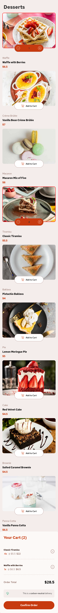
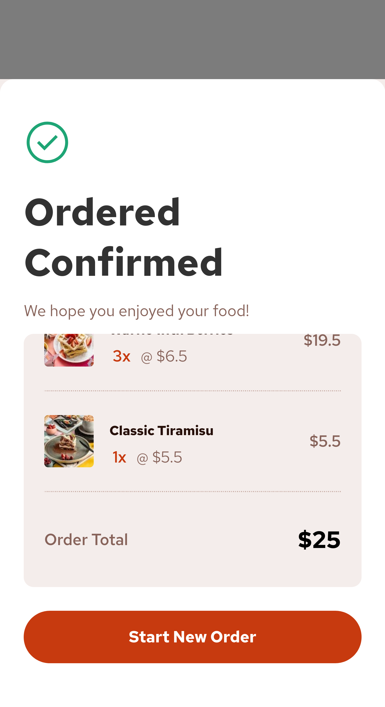
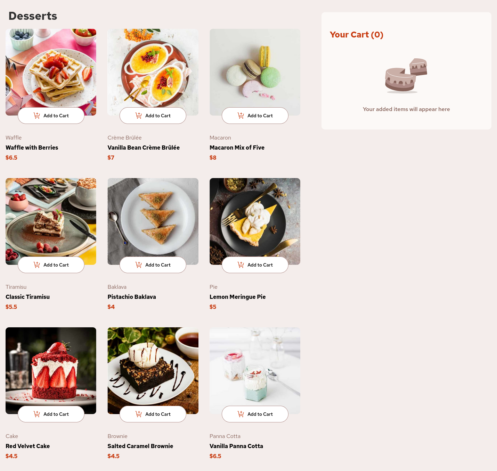
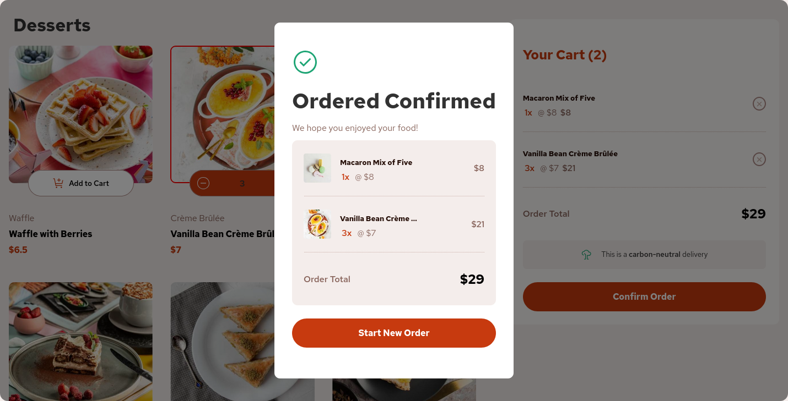

# Frontend Mentor - Product List with Cart

[Live URL](https://prabhu7x.github.io/product-list-with-cart-main/)

  
  
  
  

## Welcome! 👋

Thanks for checking out this front-end coding challenge.

I designed this challenge with fully responsive according to screen resolution - mobile and Desktop

check out these previews below

- HTML
- CSS
- ReactJS
    - for state management I used Redux

If you have any suggestions or improvements, feel free to contribute!
Acknowledgements

